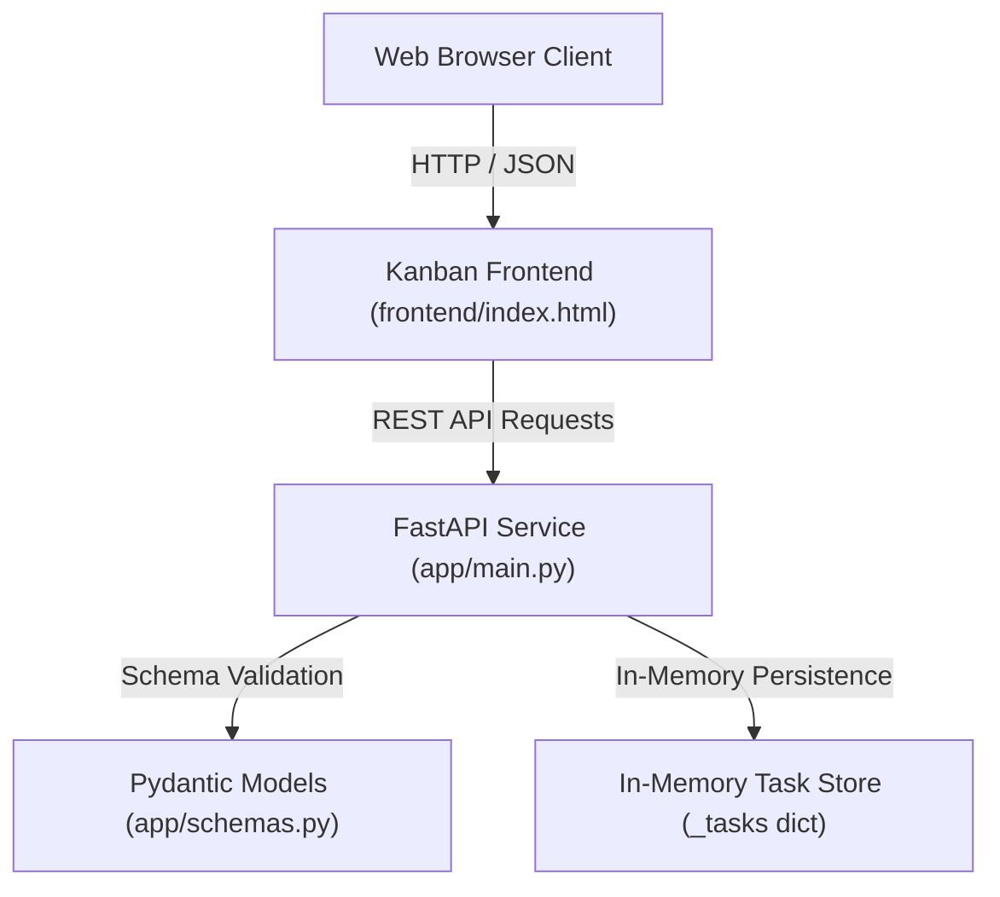

# System Architecture & Context Engineering Synthesis

This document details the architectural layout, core backend and frontend components, data flow, and context engineering analysis for the Task Tracker application.

---

## 1. System Context Diagram

---

## 2. Component Design & Responsibilities

### Backend Infrastructure (`app/main.py` & `app/schemas.py`)
- **App Configuration**: FastAPI instance configured with metadata, healthcheck route (`/health`), root page (`/`), and frontend asset mounts (`/frontend`, with `/static` compatibility fallback).
- **REST Endpoints**: Full CRUD endpoints under `/api/tasks` supporting task creation, listing, detail retrieval, partial updates, and deletion.
- **Validation Engine**: Pydantic v2 schemas (`TaskCreate`, `TaskUpdate`, `TaskResponse`) ensuring string length limits, tag counts (max 10), tag length (max 30), and ISO date formatting.
- **State Guardrails**: `validate_transition()` function preventing illegal state rollbacks (`todo` -> `in_progress` -> `done`).

### Frontend Interface (`frontend/index.html`, `frontend/app.js`)
- Responsive Kanban layout providing an inline task form, edit/delete actions, column views, tag chips, timeline filters, search, and status transitions.

---

## 3. Context Engineering Performance Comparison

| Prompt Strategy | Context Provided | Result Quality & Accuracy |
| :--- | :--- | :--- |
| **Strategy A (Minimal)** | Broad instruction without file pointers | Generic code requiring manual adjustments to fit workspace |
| **Strategy B (Structured)** | Prompt including schema bounds & validation rules | Functional code matching schema definitions |
| **Strategy C (Targeted Grounded)** | Detailed prompt with file paths, schemas, and test requirements | High-quality implementation passing all unit tests cleanly on first attempt |
